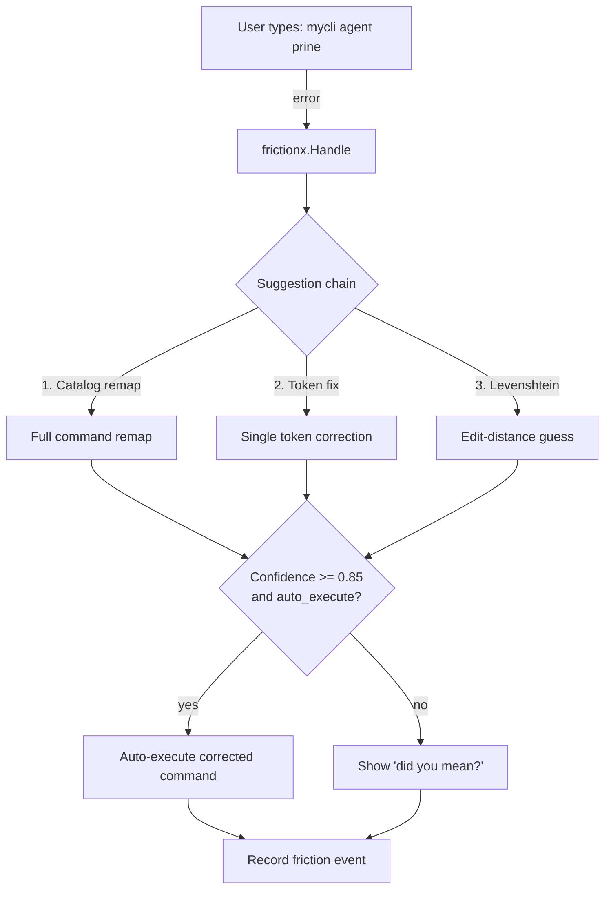

# frictionx

CLI friction detection, correction, and telemetry for Go command-line tools.

When users or AI agents type the wrong command, frictionx detects the error, suggests corrections, and optionally auto-executes high-confidence fixes. Friction events reveal **desire paths** — patterns where users consistently expect something that doesn't exist yet.

Extracted from the [ox CLI](https://github.com/sageox/ox/). Built by [SageOx](https://sageox.ai).

> **See it in action:** [The Hive is Buzzing](https://sageox.ai/blog/the-hive-is-buzzing) — how we use frictionx to fine-tune CLIs for coding agents.

[](https://sageox.ai/blog/the-hive-is-buzzing)

## The problem

CLIs fail hard on unknown commands:

```
Error: unknown command "agent-list"
Run 'mycli --help' for usage.
```

frictionx turns failure into guidance:

```
Error: unknown command "agent-list"

Did you mean?
    mycli agent list
```

Coding agents (Claude Code, Cursor, Copilot) frequently hallucinate CLI commands. frictionx detects intent, suggests the right command, and teaches the agent the correct syntax — without permanent aliases cluttering the interface.

## Install

```bash
go get github.com/sageox/frictionx
```

## Quick start

```go
package main

import (
    "os"

    "github.com/sageox/frictionx"
    frictioncobra "github.com/sageox/frictionx/adapters/cobra"
    "github.com/spf13/cobra"
)

func main() {
    root := &cobra.Command{Use: "mycli"}
    // ... add subcommands ...

    adapter := frictioncobra.NewCobraAdapter(root)
    f := frictionx.New(adapter,
        frictionx.WithCatalog("mycli"),
    )
    defer f.Close()

    if err := root.Execute(); err != nil {
        result := f.Handle(os.Args[1:], err)
        if result != nil {
            result.Emit(false) // human-friendly output
        }
        os.Exit(1)
    }
}
```

## How it works



## Suggestion chain

Suggestions are tried in priority order:

1. **Catalog remap** — Full command remaps from learned patterns (highest confidence)
2. **Token fix** — Single-token corrections from the catalog
3. **Levenshtein** — Edit-distance fallback for typos (never auto-executed)

## Adapters

frictionx works with any CLI framework via the `CLIAdapter` interface. Built-in adapters:

| Adapter | Import |
|---------|--------|
| [Cobra](https://github.com/spf13/cobra) | `github.com/sageox/frictionx/adapters/cobra` |
| [Kong](https://github.com/alecthomas/kong) | `github.com/sageox/frictionx/adapters/kong` |
| [urfave/cli](https://github.com/urfave/cli) | `github.com/sageox/frictionx/adapters/urfavecli` |

### Custom adapter

Implement the `CLIAdapter` interface:

```go
type CLIAdapter interface {
    CommandNames() []string
    FlagNames(command string) []string
    ParseError(err error) *ParsedError
}
```

## Options

```go
f := frictionx.New(adapter,
    frictionx.WithCatalog("mycli"),                              // enable learned corrections
    frictionx.WithTelemetry("https://api.example.com", "1.0"),   // report friction events
    frictionx.WithAuth(func() string { return token }),          // bearer token for telemetry
    frictionx.WithRedactor(secrets.New()),                       // redact secrets from events
    frictionx.WithActorDetector(myDetector),                     // custom human/agent detection
    frictionx.WithCachePath("/tmp/mycli-catalog.json"),          // persist catalog to disk
    frictionx.WithIsEnabled(func() bool { return true }),        // toggle telemetry
)
defer f.Close()
```

## Agent output

frictionx formats output differently for agents vs humans:

**Human** (stderr):
```
Did you mean?
    mycli agent list
```

**Agent** (stdout JSON):
```json
{"_corrected": {"was": "agent-list", "now": "agent list", "note": "Use 'mycli agent list' next time"}}
```

Agents see corrections in their context and learn the correct syntax for subsequent calls.

## Secret redaction

Built-in redactor with 25+ patterns (AWS, GitHub, Slack, Stripe, JWTs, connection strings):

```go
import "github.com/sageox/frictionx/redactors/secrets"

f := frictionx.New(adapter, frictionx.WithRedactor(secrets.New()))
```

## Privacy

- Secrets redacted via pluggable `Redactor` interface
- File paths bucketed to categories, not captured verbatim
- Error messages truncated and sanitized
- No user identity or repository names captured

## Related projects

- **[ox](https://github.com/sageox/ox/)** — The CLI that frictionx was extracted from
- **[agentx](https://github.com/sageox/agentx/)** — Discover and adapt CLI behavior to specific coding agents

## License

MIT — see [LICENSE](LICENSE).
