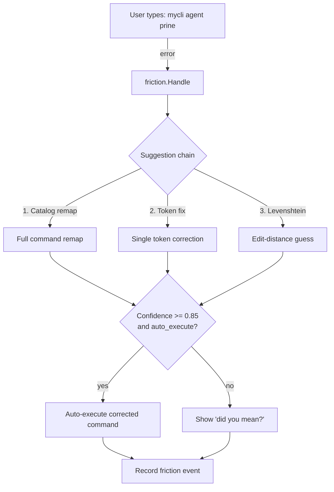

# FrictionAX

Library for understanding and optimizing for the **Agent Experience (AX)** - a new category of developer tooling that optimizes CLIs for AI coding agents, not just humans.

FrictionAX is a Go library for CLI friction detection, correction, and telemetry. When users or AI agents type the wrong command, FrictionAX detects the error, suggests corrections, and optionally auto-executes high-confidence fixes. FrictionAX events are collected and forwarded to **your own backend** for analysis, revealing **desire paths** — patterns where users consistently expect something that doesn't exist yet. [Watch how we discovered agents wanted a `query` command →](https://youtu.be/ODMZyEU3Bz8?t=32)

FrictionAX is a client-side library. You provide the collection endpoint, dashboard, and storage — FrictionAX handles the detection, suggestion, redaction, and buffered upload.

This was originally extracted from [SageOx's](https://sageox.ai/) [ox CLI](https://github.com/sageox/ox/).

> **See it in action:** [The Hive is Buzzing](https://sageox.ai/blog/the-hive-is-buzzing) — how we use friction to fine-tune CLIs for coding agents.

[](https://sageox.ai/blog/the-hive-is-buzzing)

## The problem

CLIs fail hard on unknown commands:

```
Error: unknown command "agent-list"
Run 'mycli --help' for usage.
```

FrictionAX turns failure into guidance:

```
Error: unknown command "agent-list"

Did you mean?
    mycli agent list
```

Coding agents (Claude Code, Cursor, Copilot) frequently hallucinate CLI commands. FrictionAX detects intent, suggests the right command, and teaches the agent the correct syntax — without permanent aliases cluttering the interface.

## Install

```bash
go get github.com/sageox/frictionax
```

## Quick start

```go
package main

import (
    "os"

    "github.com/sageox/frictionax"
    frictioncobra "github.com/sageox/frictionax/adapters/cobra"
    "github.com/spf13/cobra"
)

func main() {
    root := &cobra.Command{Use: "mycli"}
    // ... add subcommands ...

    adapter := frictioncobra.NewCobraAdapter(root)
    f := friction.New(adapter,
        friction.WithCatalog("mycli"),
    )
    defer f.Close()

    if err := root.Execute(); err != nil {
        result := f.Handle(os.Args[1:], err)
        if result != nil {
            result.Emit(false) // human-friendly output
        }
        os.Exit(1)
    }
}
```

## How it works



## Suggestion chain

Suggestions are tried in priority order:

1. **Catalog remap** — Full command remaps from learned patterns (highest confidence)
2. **Token fix** — Single-token corrections from the catalog
3. **Levenshtein** — Edit-distance fallback for typos (never auto-executed)

## Adapters

FrictionAX works with any CLI framework via the `CLIAdapter` interface. Built-in adapters:

| Adapter | Import |
|---------|--------|
| [Cobra](https://github.com/spf13/cobra) | `github.com/sageox/frictionax/adapters/cobra` |
| [Kong](https://github.com/alecthomas/kong) | `github.com/sageox/frictionax/adapters/kong` |
| [urfave/cli](https://github.com/urfave/cli) | `github.com/sageox/frictionax/adapters/urfavecli` |

### Custom adapter

Implement the `CLIAdapter` interface:

```go
type CLIAdapter interface {
    CommandNames() []string
    FlagNames(command string) []string
    ParseError(err error) *ParsedError
}
```

## Options

```go
f := friction.New(adapter,
    friction.WithCatalog("mycli"),                              // enable learned corrections
    friction.WithTelemetry("https://api.example.com", "1.0"),   // report friction events
    friction.WithAuth(func() string { return token }),          // bearer token for telemetry
    friction.WithRedactor(secrets.New()),                       // redact secrets from events
    friction.WithActorDetector(myDetector),                     // custom human/agent detection
    friction.WithCachePath("/tmp/mycli-catalog.json"),          // persist catalog to disk
    friction.WithIsEnabled(func() bool { return true }),        // toggle telemetry
)
defer f.Close()
```

## Telemetry

FrictionAX buffers friction events in-process and periodically sends them to your endpoint via `POST`. You build and host the collection service — FrictionAX handles the client side.

Events are sent as JSON batches:

```json
{"v": "1.0", "events": [{"ts": "...", "kind": "unknown-command", "command": "agent", "actor": "agent", "input": "mycli agent-list", "error_msg": "unknown command \"agent-list\"", "suggestion": "mycli agent list"}]}
```

The collector supports:
- **Buffered batching** — events accumulate in a ring buffer and flush periodically or when a threshold is reached
- **Rate limiting** — respects `X-Friction-Sample-Rate` and `Retry-After` headers from your server
- **Catalog sync** — your server can return updated catalog data in the response, which FrictionAX caches locally

The dashboard screenshot above is from our own service built on top of this data. What you build with the events is up to you.

### Sample collection server

The repo includes a working example server (`cmd/friction-server`) that collects events into SQLite and serves a basic dashboard — useful for local development or as a reference for building your own:

```bash
go run github.com/sageox/frictionax/cmd/friction-server@latest --port=8080 --db=./friction.db
```

| Endpoint | Method | Description |
|----------|--------|-------------|
| `/api/v1/friction` | POST | Submit friction events |
| `/api/v1/friction/status` | GET | Health and event count |
| `/api/v1/friction/summary` | GET | Aggregated patterns |
| `/api/v1/friction/catalog` | GET/PUT | Manage catalog |
| `/dashboard` | GET | HTML dashboard |

## Agent output

FrictionAX formats output differently for agents vs humans:

**Human** (stderr):
```
Did you mean?
    mycli agent list
```

**Agent** (stdout JSON):
```json
{"_corrected": {"was": "agent-list", "now": "agent list", "note": "Use 'mycli agent list' next time"}}
```

Agents see corrections in their context and learn the correct syntax for subsequent calls.

## Secret redaction

Built-in redactor with 25+ patterns (AWS, GitHub, Slack, Stripe, JWTs, connection strings):

```go
import "github.com/sageox/frictionax/redactors/secrets"

f := friction.New(adapter, friction.WithRedactor(secrets.New()))
```

## Privacy

- Secrets redacted via pluggable `Redactor` interface
- File paths bucketed to categories, not captured verbatim
- Error messages truncated and sanitized
- No user identity or repository names captured

## AX Toolchain

FrictionAX is part of the **Agent Experience (AX)** toolchain — open-source libraries for building CLIs that work well with AI coding agents:

- **[FrictionAX](https://github.com/sageox/frictionax/)** — Friction detection, correction, and telemetry for Agent Experience (this repo)
- **[AgentX](https://github.com/sageox/agentx/)** — Detect which coding agent is calling your CLI and adapt behavior accordingly
- **[ox](https://github.com/sageox/ox/)** — The CLI where the AX toolchain was born

## Contributing

PRs welcome — see [CONTRIBUTING.md](CONTRIBUTING.md).

## License

MIT — see [LICENSE](LICENSE).
